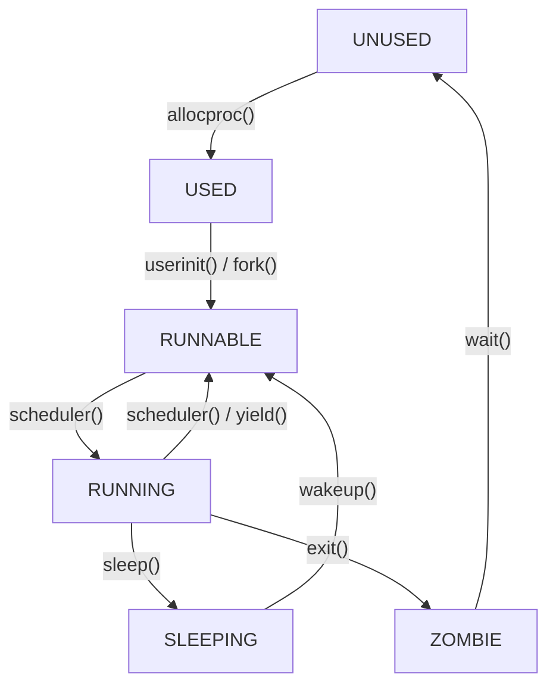

# 第 4 章: 调度 (Scheduling)

## 1. 教学目标

本章旨在帮助理解现代操作系统如何通过在多个进程间共享 CPU 来实现多任务处理。学完本章后，你应该能够：

1.  **理解多路复用**：明白为什么需要调度机制，以及操作系统如何通过在进程间切换来创造每个进程都拥有自己 CPU 的假象。
2.  **掌握进程生命周期**：熟悉 xv6 中进程的五种状态 (`UNUSED`, `SLEEPING`, `RUNNABLE`, `RUNNING`, `ZOMBIE`) 及其转换关系。
3.  **分析上下文切换**：深入理解上下文切换的底层机制，特别是 [`kernel/swtch.S`](source/xv6-riscv/kernel/swtch.S:5) 中 `swtch` 函数如何保存和恢复寄存器。
4.  **理解调度算法**：掌握 xv6 使用的简单轮询（Round-Robin）调度策略，并能分析 [`kernel/proc.c`](source/xv6-riscv/kernel/proc.c:456) 中 `scheduler` 函数的实现。

---

## 2. 核心概念：多路复用与调度

在任何分时系统中，进程的数量通常远多于 CPU核心的数量。为了让所有进程都能“同时”运行，操作系统必须实现 **多路复用 (Multiplexing)**，即在多个进程之间快速切换，轮流使用 CPU。这种切换过程对用户进程来说是透明的，给用户一种每个程序都独占一个 CPU 的错觉。

实现多路复用需要一个 **调度器 (Scheduler)**，它负责决定下一个应该在 CPU 上运行哪个进程。xv6 的调度在以下两种情况下发生：
*   **协作式调度**：当进程因等待某个事件（如等待 I/O、等待子进程退出）而无法继续执行时，它会主动调用 `sleep` 函数放弃 CPU。
*   **抢占式调度**：当一个进程运行时间过长，定时器中断会强制剥夺其 CPU 使用权，通过调用 `yield` 函数，让其他进程有机会运行。

---

## 3. 进程的生命周期

在 xv6 中，每个进程在其生命周期内都会经历一系列状态。这些状态定义在 [`kernel/proc.h`](source/xv6-riscv/kernel/proc.h:86) 的 `enum procstate` 中。

```c
// kernel/proc.h

enum procstate {
  UNUSED,   // 进程槽位未使用
  USED,     // 进程正在初始化，尚未准备好运行
  SLEEPING, // 进程正在等待某个事件（如I/O完成、管道数据等）
  RUNNABLE, // 进程已准备就绪，等待调度器分配CPU
  RUNNING,  // 进程当前正在CPU上执行
  ZOMBIE    // 进程已终止，但其父进程尚未通过 `wait()` 回收其资源
};
```

进程状态转换图如下：



*   **`UNUSED`**: 表示 `proc` 结构体是空闲的，可以被新进程使用。
*   **`USED`**: 进程刚刚被 `allocproc` 分配，正在进行初始化，还不能被调度。
*   **`RUNNABLE`**: 进程已万事俱备，只欠 CPU。它位于可运行队列中，等待调度器选择它。
*   **`RUNNING`**: 进程正在某个 CPU 上执行代码。
*   **`SLEEPING`**: 进程正在等待一个外部事件，例如磁盘读取完成或 `sleep()` 系统调用结束。它不会被调度，直到被 `wakeup()` 唤醒。
*   **`ZOMBIE`**: 进程已经执行完毕（通过 `exit()`），但其父进程还没有调用 `wait()` 来回收其资源（如进程描述符和退出状态）。僵尸进程不消耗 CPU，只占用进程表中的一个条目。

---

## 4. 上下文切换：`swtch` 的魔力

上下文切换是调度的核心机制。它指的是保存当前运行进程（或内核线程）的 CPU 状态（寄存器），并加载下一个要运行进程（或内核线程）的状态。在 xv6 中，这个神奇的过程由 [`kernel/swtch.S`](source/xv6-riscv/kernel/swtch.S:5) 中的 `swtch` 函数完成。

### 4.1 上下文 (`struct context`)

一个线程的内核上下文被保存在 `struct context` 结构体中（定义于 [`kernel/proc.h`](source/xv6-riscv/kernel/proc.h:7)）。它只包含**被调用者保存 (callee-saved)** 的寄存器。这是因为调用 `swtch` 的 C 代码会负责保存**调用者保存 (caller-saved)** 的寄存器。

```c
// kernel/proc.h

struct context {
  uint64 ra;  // 返回地址
  uint64 sp;  // 栈指针

  // Callee-saved registers
  uint64 s0;
  uint64 s1;
  // ... s2 到 s11
};
```
*   `ra` (Return Address): 保存了 `swtch` 函数返回后应该执行的指令地址。
*   `sp` (Stack Pointer): 指向当前线程的内核栈。
*   `s0`-`s11`: callee-saved 寄存器，必须由 `swtch` 这样的被调用函数来保存和恢复。

### 4.2 `swtch` 函数详解

`swtch` 函数用汇编实现，因为它需要直接操作寄存器。它接受两个参数：`struct context *old` 和 `struct context *new`。

```assembly
# kernel/swtch.S

.globl swtch
swtch:
        # 保存旧线程的上下文
        # a0 寄存器存放 old context 的地址
        sd ra, 0(a0)      # 保存返回地址
        sd sp, 8(a0)      # 保存栈指针
        sd s0, 16(a0)     # 保存 s0
        # ... 保存 s1 到 s11

        # 加载新线程的上下文
        # a1 寄存器存放 new context 的地址
        ld ra, 0(a1)      # 加载新线程的返回地址
        ld sp, 8(a1)      # 加载新线程的栈指针
        ld s0, 16(a1)     # 加载新线程的 s0
        # ... 加载 s1 到 s11

        # 返回到新加载的返回地址 (ra)
        ret
```

**工作流程**:
1.  **保存旧上下文**：`swtch` 将 `ra`, `sp` 和 `s0-s11` 等寄存器的当前值保存到 `old` 指针指向的内存地址。
2.  **加载新上下文**：`swtch` 从 `new` 指针指向的内存地址中，将之前保存的寄存器值加载到对应的 CPU 寄存器中。
3.  **返回**：`ret` 指令会跳转到新加载的 `ra` 寄存器所指向的地址。此时，CPU 的执行流已经完全切换到了新的线程，栈也切换到了新线程的内核栈。上下文切换完成。

---

## 5. xv6 的调度器

xv6 的调度器非常简单，采用 **轮询 (Round-Robin)** 策略。每个 CPU 核心都有一个独立的调度器线程，该线程在一个无限循环中执行 [`scheduler`](source/xv6-riscv/kernel/proc.c:456) 函数。

### 5.1 `scheduler` 函数

`scheduler` 的核心逻辑如下：

```c
// kernel/proc.c

void
scheduler(void)
{
  struct proc *p;
  struct cpu *c = mycpu();
  
  c->proc = 0;
  for(;;){ // 无限循环
    // 启用中断
    intr_on();

    // 遍历进程表，寻找可运行的进程
    for(p = proc; p < &proc[NPROC]; p++) {
      acquire(&p->lock);
      if(p->state == RUNNABLE) {
        // 找到了一个可运行的进程，切换到它
        p->state = RUNNING;
        c->proc = p;
        swtch(&c->context, &p->context); // 核心：切换上下文

        // ----- 从进程切换回来后，从这里继续执行 -----
        c->proc = 0;
      }
      release(&p->lock);
    }
  }
}
```

1.  **无限循环**：调度器永不停止。
2.  **遍历进程表**：它按顺序从头到尾扫描 `proc` 数组。
3.  **寻找 `RUNNABLE` 进程**：它寻找第一个状态为 `RUNNABLE` 的进程。
4.  **切换**：一旦找到，它将该进程的状态设置为 `RUNNING`，记录在当前 CPU 的 `c->proc` 中，然后调用 `swtch`，将 CPU 的控制权交给该进程。`swtch` 会将调度器线程的上下文保存在 `c->context` 中，并加载目标进程的上下文 (`p->context`)。
5.  **返回调度器**：当该进程放弃 CPU（例如调用 `yield` 或 `sleep`）时，它会调用 `swtch` 切换回调度器线程。执行流会回到 `scheduler` 函数中 `swtch` 调用的下一条指令，并继续下一轮的扫描。

### 5.2 `yield`, `sleep`, 和 `wakeup`

这三个函数是进程与调度器交互的主要方式。

*   **`yield()`**: 主动放弃 CPU。
    1.  获取当前进程的锁。
    2.  将自己的状态设置为 `RUNNABLE`。
    3.  调用 `sched()`，`sched` 内部会调用 `swtch` 切换到调度器。
    4.  释放锁。

*   **`sleep(void *chan, struct spinlock *lk)`**: 因等待某个事件而休眠。
    1.  获取进程锁 `p->lock`。
    2.  释放传入的条件锁 `lk` (这是一个原子操作，防止“丢失唤醒”问题)。
    3.  设置进程状态为 `SLEEPING`，并记录等待的通道 `chan`。
    4.  调用 `sched()` 切换到调度器。
    5.  当被唤醒后，它会从 `sched()` 返回，清空 `chan`，释放进程锁，并重新获取条件锁 `lk`。

*   **`wakeup(void *chan)`**: 唤醒在 `chan` 上休眠的所有进程。
    1.  遍历进程表。
    2.  找到所有状态为 `SLEEPING` 且等待通道为 `chan` 的进程。
    3.  将它们的状态修改为 `RUNNABLE`。
    4.  下一次调度器运行时，这些被唤醒的进程就有机会被执行。

---

## 6. 实验：实现 Lottery Scheduler

为了更深入地理解调度，你需要完成以下实验任务。

**任务要求**：
修改 xv6 的调度器，实现一个简化版的 **彩票调度 (Lottery Scheduler)** 算法。

**基本思想**：
1.  每个进程被赋予一定数量的“彩票”（tickets）。
2.  调度器在每次调度时，不再是简单地轮询，而是举行一次“抽奖”。
3.  它会从所有 `RUNNABLE` 进程的彩票总数中，随机抽取一个中奖号码。
4.  拥有这张中奖彩票的进程将获得下一个 CPU 时间片。
5.  一个进程拥有的彩票越多，它被调度到的概率就越大。

**修改提示**：
*   在 `struct proc` 中增加一个字段来存储每个进程的彩票数（例如，`int tickets`）。可以默认为一个固定值，如 100。
*   提供一个新的系统调用，允许用户进程修改自己的彩票数。
*   修改 `scheduler()` 函数的逻辑：
    *   首先，计算所有 `RUNNABLE` 进程的彩票总数。
    *   然后，生成一个介于 0 和彩票总数之间的随机数。
    *   最后，遍历 `RUNNABLE` 进程，通过累减彩票数的方式找到那个“中奖”的进程，并切换到它。

**注意**：本章只要求你理解设计并撰写文稿，具体的实现步骤将在实验指导中提供。
