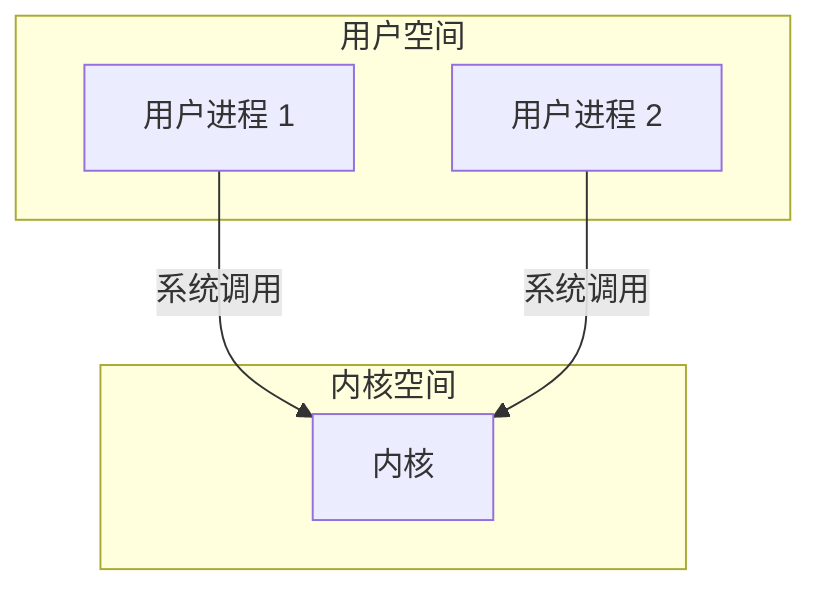

# 操作系统接口

操作系统的任务是在多个程序之间共享一台计算机，并提供一组比硬件本身支持的更有用的服务。
操作系统管理和抽象底层硬件，因此，例如，文字处理器无需关心正在使用哪种类型的磁盘硬件。
操作系统在多个程序之间共享硬件，以便它们可以同时运行（或看起来是同时运行）。
最后，操作系统为程序之间的交互提供了受控的方式，以便它们可以共享数据或协同工作。

操作系统通过一个接口向用户程序提供服务。
设计一个好的接口是困难的。一方面，我们希望接口简单而精炼，因为这样更容易确保实现的正确性。另一方面，我们可能想为应用程序提供许多复杂的功能。
解决这种矛盾的诀诀是设计依赖于少数机制的接口，这些机制可以组合起来提供很大的通用性。

本书使用一个单一的操作系统作为具体例子来说明操作系统的概念。那个操作系统，
xv6，提供了由Ken Thompson和Dennis Ritchie的Unix操作系统引入的基本接口，并模仿了Unix的内部设计。Unix提供了一个精炼的接口，其机制结合得很好，提供了惊人的通用性。这个接口非常成功，以至于现代操作系统——BSD、Linux、macOS、Solaris，甚至在较小程度上，Microsoft Windows——都有类似Unix的接口。
理解xv6是理解这些系统以及许多其他系统的一个良好开端。

如图所示，xv6采用了传统的**内核**形式，它是一个为正在运行的程序提供服务的特殊程序。
每个正在运行的程序，称为**进程**，都有一块内存，其中包含指令、数据和一个栈。指令实现了程序的计算。数据是计算作用于的变量。栈组织程序的过程序调用。
一台给定的计算机通常有许多进程，但只有一个内核。

当一个进程需要调用内核服务时，它会调用一个**系统调用**，这是操作系统接口中的一个调用。
系统调用进入内核；内核执行服务并返回。
因此，一个进程在**用户空间**和**内核空间**之间交替执行。

如后续章节所详述，内核使用CPU[^1]提供的硬件保护机制来确保每个在用户空间执行的进程只能访问自己的内存。
内核以实现这些保护所需的硬件特权执行；用户程序在没有这些特权的情况下执行。
当用户程序调用系统调用时，硬件会提升特权级别，并开始执行内核中预先安排好的函数。

[^1]:本文档通常使用术语**CPU**（中央处理单元的缩写）来指代执行计算的硬件元件。其他文档（例如，RISC-V规范）也使用处理器、核心和hart等词来代替CPU。

内核提供的系统调用集合是用户程序看到的接口。
xv6内核提供了Unix内核传统上提供的一部分服务和系统调用。
[图 1-1](./processes-and-memory.md#fig-api) 列出了xv6的所有系统调用。

本章的其余部分概述了xv6的服务——进程、内存、文件描述符、管道和文件系统——并通过代码片段和对**shell**（Unix的命令行用户界面）如何使用它们的讨论来说明它们。shell对系统调用的使用说明了它们是如何被精心设计的。

shell是一个普通的程序，它从用户那里读取命令并执行它们。
shell是一个用户程序，而不是内核的一部分，这一事实说明了系统调用接口的强大之处：shell没有什么特别之处。
这也意味着shell很容易被替换；因此，现代Unix系统有各种各样的shell可供选择，每种都有自己的用户界面和脚本功能。
xv6 shell是Unix Bourne shell精髓的一个简单实现。其实现可以在 [`user/sh.c:1`](/source/xv6-riscv/user/sh.c.md#L1) 找到。