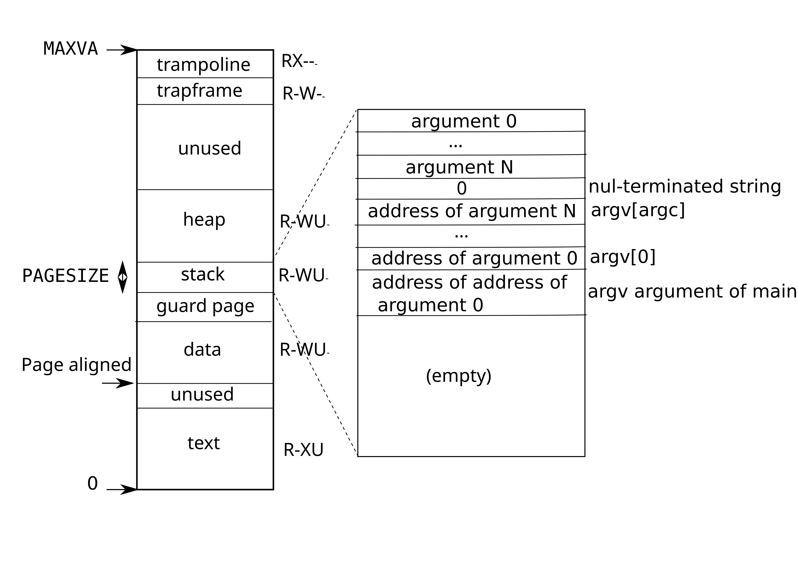

## 进程地址空间

每个进程都有自己的页表，当 xv6 在进程之间切换时，它也会更改页表。下图比图 1 更详细地显示了进程的地址空间。进程的用户内存从虚拟地址零开始，可以增长到 `MAXVA`，原则上允许一个进程寻址 256 GB 的内存。

*图 4: 一个进程的用户地址空间，及其初始栈。*

进程的地址空间由包含程序文本的页面（xv6 使用 `PTE_R`、`PTE_X` 和 `PTE_U` 权限映射）、包含程序预初始化数据的页面、一个用于栈的页面和用于堆的页面组成。Xv6 使用 `PTE_R`、`PTE_W` 和 `PTE_U` 权限映射数据、栈和堆。

在用户地址空间内使用权限是加固用户进程的常用技术。如果文本是用 `PTE_W` 映射的，那么进程可能会意外地修改自己的程序；例如，一个编程错误可能导致程序写入一个空指针，修改地址 0 处的指令，然后继续运行，可能会造成更大的破坏。为了立即检测到此类错误，xv6 映射文本时不带 `PTE_W`；如果程序意外尝试存储到地址 0，硬件将拒绝执行该存储并引发一个缺页。然后内核杀死该进程并打印一条信息性消息，以便开发人员可以追查问题。

同样，通过不带 `PTE_X` 映射数据，用户程序不能意外地跳转到程序数据中的地址并从该地址开始执行。

在现实世界中，通过仔细设置权限来加固进程也有助于防御安全攻击。攻击者可能会向程序（例如，Web 服务器）提供精心构造的输入，以触发程序中的一个错误，希望将该错误转化为一个漏洞利用。仔细设置权限和其他技术，例如随机化用户地址空间的布局，使此类攻击更加困难。

栈是一个单独的页面，并显示了由 exec 创建的初始内容。包含命令行参数的字符串，以及指向它们的指针数组，位于栈的顶端。紧随其后的是允许程序从 [`main`](/source/xv6-riscv/user/zombie.c.md) 开始的值，就好像函数 `main(argc, argv)` 刚刚被调用一样。

为了检测用户栈溢出分配的栈内存，xv6 在栈的正下方放置了一个不可访问的保护页，方法是清除 `PTE_U` 标志。如果用户栈溢出并且进程试图使用栈下方的地址，硬件将生成一个缺页异常，因为保护页对于在用户模式下运行的程序是不可访问的。一个现实世界的操作系统可能会在用户栈溢出时自动分配更多的内存。

当一个进程向 xv6 请求更多用户内存时，xv6 会增长进程的堆。Xv6 首先使用 [`kalloc`](/source/xv6-riscv/kernel/kalloc.c.md) 分配物理页面。然后它向进程的页表添加指向新物理页面的 PTE。Xv6 在这些 PTE 中设置 `PTE_W`、`PTE_R`、`PTE_U` 和 `PTE_V` 标志。大多数进程不使用整个用户地址空间；xv6 在未使用的 PTE 中将 `PTE_V` 保持清除。

我们在这里看到了一些页表使用的好例子。首先，不同进程的页表将用户地址转换为不同的物理内存页面，因此每个进程都有私有的用户内存。其次，每个进程都看到其内存具有从零开始的连续虚拟地址，而进程的物理内存可以是不连续的。第三，内核在用户地址空间的顶部映射一个带有蹦床代码的页面（不带 `PTE_U`），因此一个物理内存页面出现在所有地址空间中，但只能由内核使用。