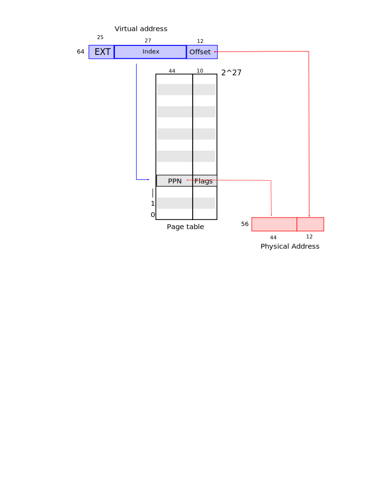

## 分页硬件

提醒一下，RISC-V 指令（用户和内核）操作的是虚拟地址。机器的 RAM 或物理内存，是使用物理地址索引的。RISC-V 页表硬件通过将每个虚拟地址映射到物理地址来连接这两种地址。

*图 1: RISC-V 虚拟和物理地址，带有一个简化的逻辑页表。*

Xv6 在 Sv39 RISC-V 上运行，这意味着 64 位虚拟地址中只有低 39 位被使用；高 25 位未使用。在这种 Sv39 配置中，RISC-V 页表在逻辑上是一个包含 $2^{27}$ (134,217,728) 个页表条目 (PTE) 的数组。每个 PTE 包含一个 44 位的物理页号 (PPN) 和一些标志。分页硬件通过使用 39 位中的高 27 位来索引页表以查找 PTE，并创建一个 56 位的物理地址，其高 44 位来自 PTE 中的 PPN，低 12 位从原始虚拟地址复制而来，从而转换虚拟地址。图 1 展示了这一过程，其中页表的逻辑视图是一个简单的 PTE 数组（更完整的故事请参见图 2）。页表使操作系统能够以 4096 ($2^{12}$) 字节的对齐块（称为页）为粒度控制虚拟到物理地址的转换。

*图 2: RISC-V 地址转换细节。*

在 Sv39 RISC-V 中，虚拟地址的高 25 位不用于转换。物理地址也有增长空间：PTE 格式中有空间让物理页号再增长 10 位。RISC-V 的设计者基于技术预测选择了这些数字。$2^{39}$ 字节是 512 GB，这对于在 RISC-V 计算机上运行的应用程序来说应该是足够的地址空间。$2^{56}$ 的物理内存空间足以在近期内容纳许多 I/O 设备和 RAM 芯片。如果需要更多，RISC-V 设计者定义了具有 48 位虚拟地址的 Sv48。

如图 2 所示，RISC-V CPU 分三步将虚拟地址转换为物理地址。页表以三级树的形式存储在物理内存中。树的根是一个 4096 字节的页表页，包含 512 个 PTE，这些 PTE 包含树中下一级页表页的物理地址。这些页中的每一个都包含 512 个 PTE，用于树的最后一级。分页硬件使用 27 位中的高 9 位在根页表页中选择一个 PTE，中间 9 位在树的下一级页表页中选择一个 PTE，低 9 位选择最终的 PTE。（在 Sv48 RISC-V 中，页表有四个级别，虚拟地址的第 39 到 47 位索引到顶层。）

如果转换地址所需的三个 PTE 中有任何一个不存在，分页硬件会引发一个缺页异常，由内核来处理该异常（参见第 4 章）。

图 2 的三级结构与图 1 的单级设计相比，提供了一种内存高效的记录 PTE 的方式。在大量虚拟地址没有映射的常见情况下，三级结构可以省略整个页目录。例如，如果一个应用程序只使用从地址零开始的几个页面，那么顶级页目录的条目 1 到 511 都是无效的，内核就不必为这 511 个中间页目录分配页面。此外，内核也不必为这 511 个中间页目录的底层页目录分配页面。因此，在这个例子中，三级设计节省了 511 个中间页目录的页面和 $511\times512$ 个底层页目录的页面。

尽管 CPU 在硬件中遍历三级结构作为执行加载或存储指令的一部分，但三级的一个潜在缺点是 CPU 必须从内存加载三个 PTE 来执行加载/存储指令中虚拟地址到物理地址的转换。为了避免从物理内存加载 PTE 的成本，RISC-V CPU 在一个翻译后备缓冲区 (TLB) 中缓存页表条目。

每个 PTE 包含一些标志位，告诉分页硬件关联的虚拟地址允许如何使用。`PTE_V` 指示 PTE 是否存在：如果未设置，引用该页会导致异常（即不允许）。`PTE_R` 控制指令是否允许读取该页。`PTE_W` 控制指令是否允许写入该页。`PTE_X` 控制 CPU 是否可以将该页的内容解释为指令并执行它们。`PTE_U` 控制用户模式下的指令是否允许访问该页；如果 `PTE_U` 未设置，则该 PTE 只能在 supervisor 模式下使用。图 2 展示了这一切是如何工作的。标志和所有其他与分页硬件相关的结构都在 [`kernel/riscv.h`](/source/xv6-riscv/kernel/riscv.h.md) 中定义。

为了告诉 CPU 使用一个页表，内核必须将根页表页的物理地址写入 `satp` 寄存器。CPU 将使用其自己的 `satp` 指向的页表来转换后续指令生成的所有地址。每个 CPU 都有自己的 `satp`，这样不同的 CPU 就可以运行不同的进程，每个进程都有由其自己的页表描述的私有地址空间。

从内核的角度来看，页表是存储在内存中的数据，内核使用类似于任何树形数据结构的代码来创建和修改页表。

关于本书中使用的一些术语的说明。*物理内存* 指的是 RAM 中的存储单元。物理内存的一个字节有一个地址，称为*物理地址*。解引用地址的指令（如加载、存储、跳转和函数调用）只使用虚拟地址，分页硬件将其转换为物理地址，然后发送到 RAM 硬件以读取或写入存储。一个*地址空间* 是在给定页表中有效的一组虚拟地址；每个 xv6 进程都有一个独立的的用户地址空间，xv6 内核也有自己的地址空间。*用户内存* 指的是进程的用户地址空间加上页表允许进程访问的物理内存。*虚拟内存* 指的是与管理页表和使用它们实现隔离等目标相关的思想和技术。

*图 3: 左侧是 xv6 的内核地址空间。RWX 指的是 PTE 的读、写和执行权限。右侧是 xv6 期望看到的 RISC-V 物理地址空间。*