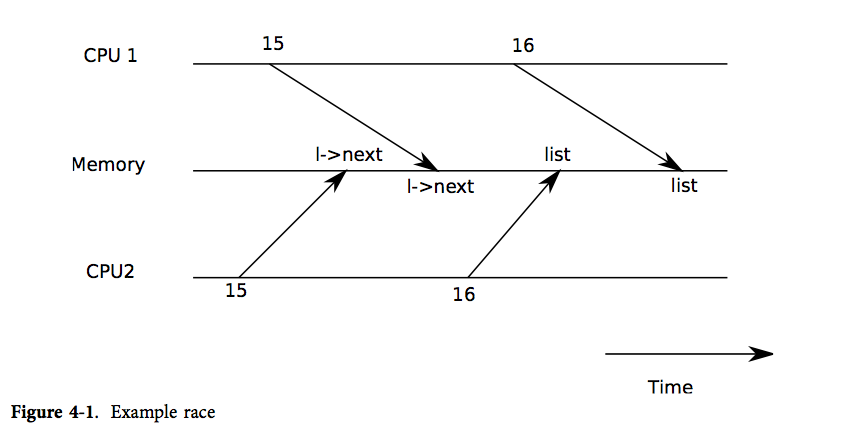

# 代码：上下文切换

图4-1概述了从一个用户进程切换到另一个用户进程所涉及的步骤：从用户空间到旧进程内核线程的陷阱（系统调用或中断），上下文切换到当前CPU的调度器线程，上下文切换到新进程的内核线程，以及陷阱返回到用户级进程。Xv6有独立的线程（保存的寄存器和栈）来执行调度器，因为让调度器在任何进程的内核栈上执行都是不安全的：其他CPU可能会唤醒该进程并运行它，在两个不同的CPU上使用同一个栈将是一场灾难。每个CPU都有一个独立的调度器线程，以应对多个CPU正在运行希望放弃CPU的进程的情况。

在本节中，我们将研究内核线程和调度器线程之间切换的机制。

从一个线程切换到另一个线程涉及保存旧线程的CPU寄存器，并恢复新线程先前保存的寄存器；栈指针和程序计数器被保存和恢复的事实意味着CPU将切换栈和正在执行的代码。

函数[`swtch`](/source/xv6-riscv/kernel/defs.h.md)为内核线程切换保存和恢复寄存器。[`swtch`](/source/xv6-riscv/kernel/defs.h.md)不直接了解线程；它只是保存和恢复一组RISC-V寄存器，称为上下文（contexts）。当一个进程需要放弃CPU时，该进程的内核线程调用[`swtch`](/source/xv6-riscv/kernel/defs.h.md)来保存自己的上下文并恢复调度器的上下文。每个上下文都包含在一个`struct context`中，它本身包含在一个进程的`struct proc`或一个CPU的`struct cpu`中。[`swtch`](/source/xv6-riscv/kernel/defs.h.md)接受两个参数：`struct context *old`和`struct context *new`。它将当前寄存器保存在`old`中，从`new`加载寄存器，然后返回。

让我们跟随一个进程通过[`swtch`](/source/xv6-riscv/kernel/defs.h.md)进入调度器。我们在第3章看到，中断结束时的一种可能性是[`usertrap`](/source/xv6-riscv/kernel/trap.c.md)调用[`yield`](/source/xv6-riscv/kernel/defs.h.md)。[`yield`](/source/xv6-riscv/kernel/defs.h.md)转而调用[`sched`](/source/xv6-riscv/kernel/defs.h.md)，后者调用[`swtch`](/source/xv6-riscv/kernel/defs.h.md)将当前上下文保存在`p->context`中，并切换到先前保存在`cpu->context`中的调度器上下文。

[`swtch`](/source/xv6-riscv/kernel/defs.h.md)只保存被调用者保存的寄存器；C编译器在调用者中生成代码以在栈上保存调用者保存的寄存器。[`swtch`](/source/xv6-riscv/kernel/defs.h.md)知道`struct context`中每个寄存器字段的偏移量。它不保存程序计数器。相反，[`swtch`](/source/xv6-riscv/kernel/defs.h.md)保存`ra`寄存器，该寄存器保存了调用[`swtch`](/source/xv6-riscv/kernel/defs.h.md)的返回地址。现在[`swtch`](/source/xv6-riscv/kernel/defs.h.md)从新上下文中恢复寄存器，新上下文保存了先前[`swtch`](/source/xv6-riscv/kernel/defs.h.md)保存的寄存器值。当[`swtch`](/source/xv6-riscv/kernel/defs.h.md)返回时，它返回到恢复的`ra`寄存器所指向的指令，即新线程先前调用[`swtch`](/source/xv6-riscv/kernel/defs.h.md)的指令。此外，它在新线程的栈上返回，因为恢复的`sp`指向那里。

在我们的例子中，[`sched`](/source/xv6-riscv/kernel/defs.h.md)调用[`swtch`](/source/xv6-riscv/kernel/defs.h.md)切换到`cpu->context`，即每个CPU的调度器上下文。该上下文是在过去某个时刻[`scheduler`](/source/xv6-riscv/kernel/proc.c.md)调用[`swtch`](/source/xv6-riscv/kernel/defs.h.md)切换到当前放弃CPU的进程时保存的。当我们一直在跟踪的[`swtch`](/source/xv6-riscv/kernel/defs.h.md)返回时，它不会返回到[`sched`](/source/xv6-riscv/kernel/defs.h.md)，而是返回到[`scheduler`](/source/xv6-riscv/kernel/proc.c.md)，栈指针位于当前CPU的调度器栈中。